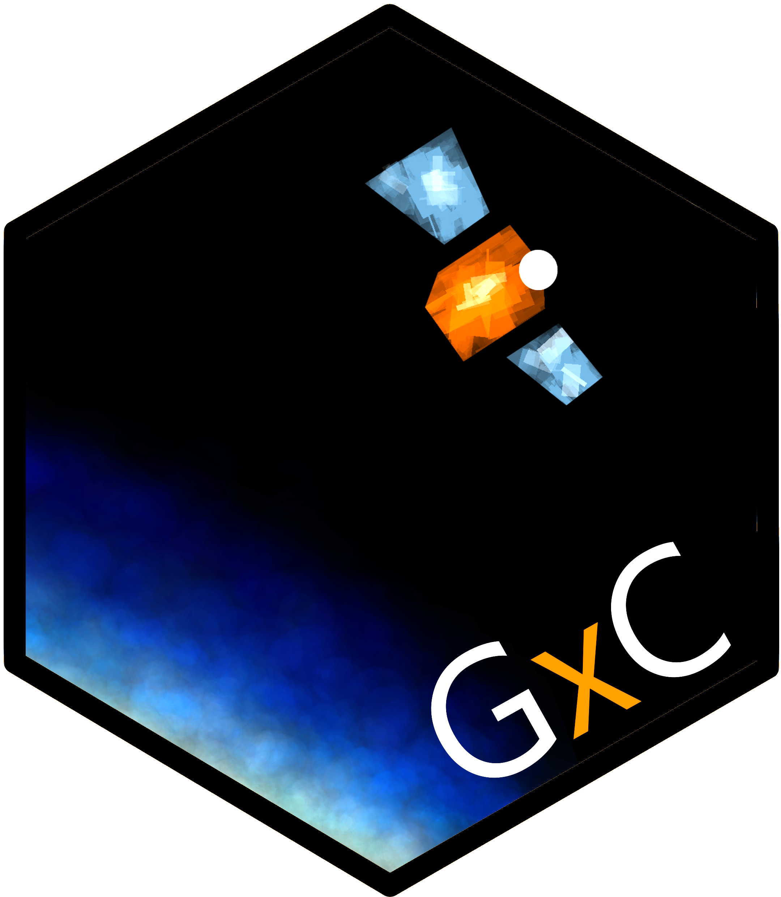
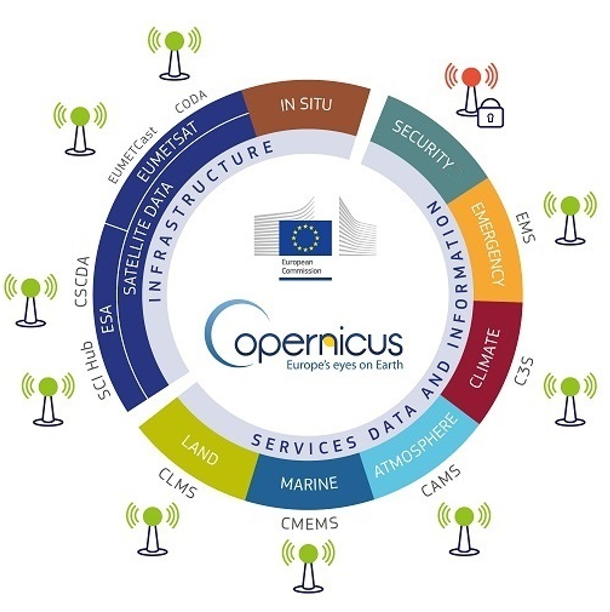

# gxc



Welcome to the package website of "GESIS meets Copernicus" (gxc).

For many researchers in the social sciences, Earth observation (EO) data 
represents a black box. Social science researchers face many obstacles in applying 
and using these data, resulting from 1) a lack of technical expertise, 
2) a lack of knowledge of data sources and how to access them, 
3) unfamiliarity with complex data formats, such as high-resolution, 
longitudinal raster datacubes, and 4) lack of expertise in integrating the data 
into existing social science datasets. GxC aims to close the gap by creating an automated 
interface to EO data and complementary resources for social science research. 

The project's core is creating an open-source tool to link time- and 
space-sensitive social science datasets with data from Earth observation programs. 
Detailed documentation and beginner-friendly tutorials complement the tool to 
showcase the capability of our project. The social science community is the 
main target group of our tool. At the same time, Earth system science researchers 
may similarly profit from integrated social science data. This project supports 
inter- and transdisciplinary research which is often made difficult because of 
technical, disciplinary, and organizational barriers. The project emphasizes 
research data management (RDM) workflows based on FAIR and Open Data principles.
All code is written in the open-source software R and is made available on this
website.

## Sources of Earth observation data

Europe's Earth Observation programme is called [Copernicus](https://www.copernicus.eu/en).
It is funded and managed by the European Commission and partners like the 
[European Space Agency](https://www.esa.int/) (ESA) and the 
[European Organisation for the Exploitation of Meteorological Satellites](https://www.eumetsat.int/) (EUMETSAT). 
It has been operational since 2014 and provides free access to a wealth of 
satellite data from ESA's “Sentinel” fleet. Copernicus combines data from satellites, 
ground-based as well as air- and sea-borne sensors to track the Earth system and 
provide this information largely free for all customers.

The ESA describes Copernicus as the world's most ambitious Earth observation 
program, which will be further expanded in the coming years. On the [Copernicus homepage](https://www.copernicus.eu/en/access-data.), the daily data collection 
is estimated at 12 terabytes. Given the complexity of issues, Copernicus has 
separated its services for public usage along several thematic areas:

- **Atmosphere**: [Copernicus Atmosphere Monitoring Service](https://atmosphere.copernicus.eu/) (CAMS)
- **Marine**: [Copernicus Marine Service](https://marine.copernicus.eu/) (CMEMS)
- **Land**: [Copernicus Land Monitoring Service](https://land.copernicus.eu/en) (CLMS)
- **Climate change**: [Copernicus Climate Change Service](https://climate.copernicus.eu/) (C3S)
- **Emergency**: [Copernicus Emergency Management Service](https://emergency.copernicus.eu/) (CEMS).



Source: [Copernicus infrastructure and data services](https://www.copernicus.eu/en/accessing-data-where-and-how/conventional-data-access-hubs)

This project focuses on the data provided by the Copernicus programme. However,
this is not the only relevant source of EO data which you can consider for your
projects. The US equivalent, for example, is based on the [Landsat satellite programme](https://landsat.gsfc.nasa.gov/), 
which is jointly operated by [NASA](https://www.nasa.gov/) and the 
[US Geological Survey](https://www.usgs.gov/landsat-missions) (USGS). [Google's Earth Engine Cloud Computing Platform](https://developers.google.com/earth-engine/datasets/catalog)
catalogs an extensive selection of additional data sets from various sources.

## Package features

The unique feature of the tool should be the possibility of carrying out both 
geographically and temporally high-resolution queries of data from Copernicus 
and other Earth observation data sources, which at the same time function 
efficiently on simple workstations albeit large amounts of data. Our tested 
workflow development has identified five major levers: indicator type, indicator 
intensity, focal time period, baseline time period, and spatial buffer. 
Flexibility on these five attributes should be maximized for users. The tool 
also offers the functionality to automatically derive spatio-temporal links with 
other georeferenced data (e.g., surveys, digital behavioral data).

Users should benefit from the core variables integrated into the interface for 
social research. Preparatory work is currently being carried out to select 
appropriate indicators from the corpus of indicators offered by data providers 
and conceptualize the data integration logic. Furthermore, in exchange with users 
and other stakeholders, we compile data products from EOD that are particularly 
relevant for social scientists. Examples include data on local air quality and 
pollutants, extreme weather events, or land use changes. The main data providers 
will be the Copernicus Monitoring Services on Climate Change, Atmosphere, and Land.


Major attributes for indicator specification. Source: Abel and Jünger 2024

GESIS strongly supports the FAIR data principles and Open Data. The selection of 
R as the programming language for the tool supports open-source infrastructure 
development and shareability, as well as quality control via online repositories. 
Publishing the R scripts for data management and analysis ensures the 
reproducibility of all research steps. 

## Example: Global temperature

For ERA5 and polygons

### Package setup

```{r setup}
# Install and load required packages
required_packages <- c("devtools", "keyring", "rnaturalearth", "sf", "tidyverse")
new_packages <- required_packages[!(required_packages %in% installed.packages()[,"Package"])]
if(length(new_packages)) install.packages(new_packages)
lapply(required_packages, library, character.only = TRUE)

# Load gxc package (locally for now)
devtools::load_all()
```


### Load a world map

```{r map}
# Download world map data
world <- ne_countries(scale = "medium", returnclass = "sf")
st_geometry(world)

# Subset to relevant variables
world <- world |> 
  select(admin, iso_a3, postal, geometry)

# Create fixed date-variable
world$date_raw <- "08-2014"

# Plot world map
plot(world[1])
```


### Store your API-key

# ```{r key}
# api_key <- Sys.getenv("WF_API_KEY")
# 
# keyring::key_set_with_value(service = "wf_api_key", password = api_key)
# 
# ```
# 
# 
# ### Run poly_link-function
# 
# ```{r poly_link}
# dataset_out <- poly_link(
#   indicator = "2m_temperature",
#   data = world,
#   date_var = "date_raw",
#   time_span = 0,
#   time_lag = 0,
#   baseline = FALSE,
#   min_year = "1989",
#   max_year = "1990",
#   order = "my",
#   path = "./data/raw")
# 
# ```
# 
# ### Explore the extended dataset
# 
# ```{r dataset}
# head(dataset_out)
# 
# ```
# 
# ```{r visualize}
# ggplot(data = dataset_out) +
#   geom_sf(aes(fill = focal_value)) +
#   scale_fill_viridis_c() +
#   theme_minimal() +
#   labs(
#     title = "Mean temperature (K) in August 2014",
#     subtitle = "Averaged across countries",
#     fill = "Temperature (K)"
#   )
# 
# ```
