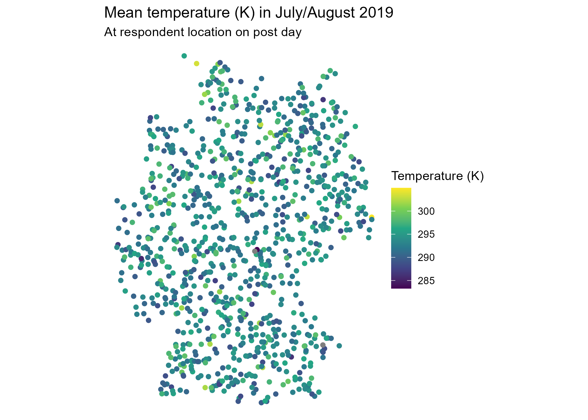
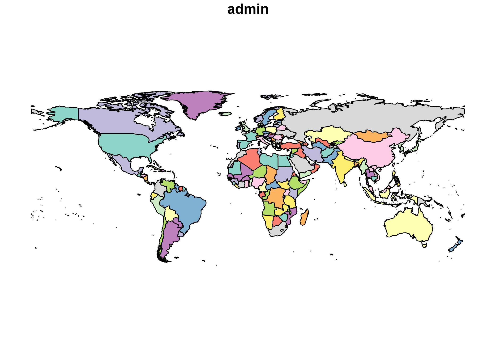
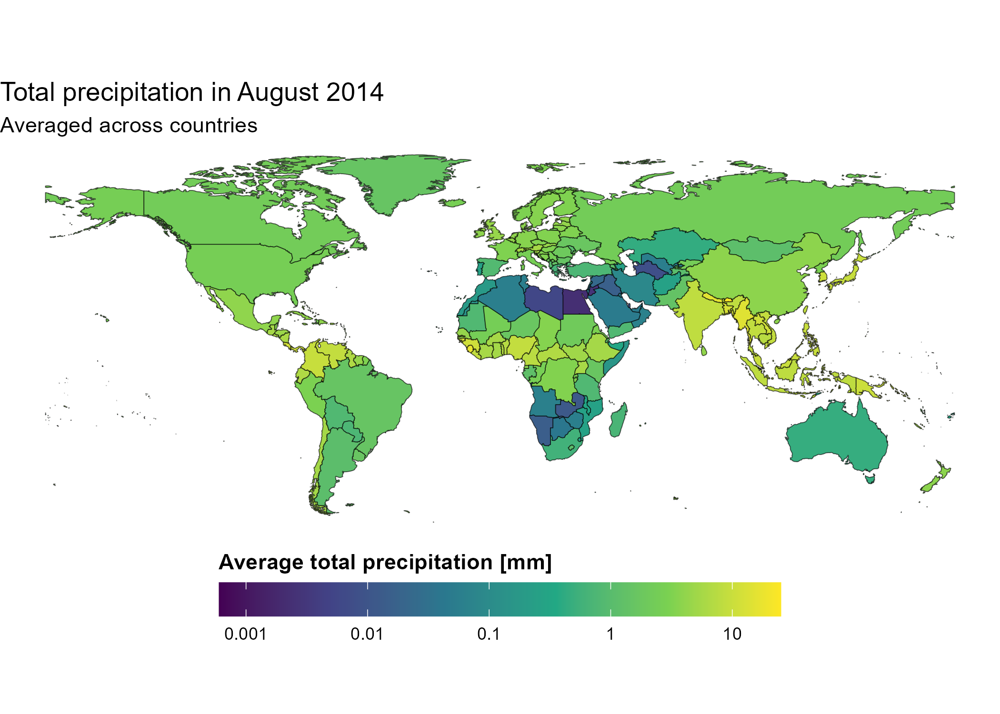

[](https://www.repostatus.org/#active)
[](https://github.com/denabel/gxc/actions/workflows/R-CMD-check.yaml)
[](https://app.codecov.io/gh/denabel/gxc)
[](https://choosealicense.com/licenses/mit/)
[](/commits/master)

[](https://doi.org/10.5281/zenodo.15041278)
<!-- 
[](https://github.com/denabel/gxc/actions?query=workflow%3Apkgcheck)
-->

# gxc: Easy access to Earth observation data 🌍


> **This is a major new version of `gxc`.** The linking interface has
> been substantially redesigned: output columns are renamed (`.linked` →
> `.study`, `.deviation` → `.result`), DWD data is now supported without
> an API key, and a new set of arguments (`baseline_fun`, `study_fun`,
> `stat_wrangling`, `prefix`, `months`) gives fine-grained control over
> how indicators are summarised and compared. See [NEWS.md](NEWS.md) for
> the full changelog.

For many researchers in the social sciences, **Earth observation (EO)**
data is a black box. This is mainly caused by a lack of knowledge about
techniques or data sources and unfamiliarity with complex data formats
such as high-resolution spatio-temporal raster data cubes. `gxc`
connects social science data to EO data sources — primarily Copernicus
ERA5 and the German Weather Service (DWD) — enabling easy integration of
spatial and temporal EO indicators. The package is designed for social
scientists but may also be useful for earth system researchers.

Key features:

- Link social science data to Copernicus ERA5 and DWD via five main
  attributes: indicator, intensity, time period, baseline, and spatial
  buffer
- Flexible baseline comparisons: deviation, z-score, count-above/below
  thresholds
- DWD HYRAS data (1 km, Germany) accessible without any API key
- Easily integrate complex spatio-temporal data formats into social
  science workflows
- Curated EO indicators: weather, climate, with more coming soon (e.g.,
  air quality, GHG, land cover)
- Supports an interactive interface through Shiny: *coming soon*
- FAIR and open science principles

For more infos and tutorials, check out our [online
compendium](https://denabel.github.io/gxc_pages/).

For our current list of curated indicators, see our [indicator
catalogue](https://denabel.github.io/gxc_pages/catalogue.html).

## Installation instructions

To install the package from GitHub:

``` r
if (!require(pak)) install.packages("pak")
pak::pkg_install("denabel/gxc")
library(gxc)
```

## API Access

`gxc` integrates two data sources:

**Copernicus / ERA5** — the main source for global climate reanalysis
data. Access requires a free [ECMWF
account](https://www.ecmwf.int/user/login). All requests are handled via
the [ecmwfr](https://github.com/bluegreen-labs/ecmwfr) package. To store
your API key inside R:

``` r
set_api_key("ecmwfr")
```

**DWD (German Weather Service)** — provides 1 km gridded HYRAS data for
Germany. No API key or registration required. Data is downloaded
directly from the [DWD open data server](https://opendata.dwd.de/).

## How to use

### Example 1: Retrieving daily temperature for point data

In this example, we show how to use `link_daily()` to integrate
temperature data from ERA5 reanalysis for a set of spatial points. Let’s
assume we have a series of georeferenced social media posts on climate
change and we would like to understand how these are associated with
temperature patterns at the poster’s location.

### Package setup

We need some packages to load and prepare the world map
(`rnaturalearth`, `sf`, and `ggplot2`).

``` r
library(rnaturalearth)
library(sf)
library(ggplot2)
library(gxc)
```

### Create sample point data

Let’s assume we have a sample of social media posts across Germany
covering July and August 2019. We create a sample of random points based
on a geospatial vector dataset for Germany and add random date variables
for the field period.

``` r
# Get Germany's boundary as an sf object
germany <- 
  ne_countries(scale = "medium", country = "Germany", returnclass = "sf")

# Generate 1000 random points within Germany's boundary
set.seed(123)
n             <- 1000
random_points <- st_sample(germany, size = n)
points_sf     <- st_sf(geometry = random_points)

# Random date within field period (July-August 2019)
days          <- sample(1:31, n, replace = TRUE)
months        <- sample(c(7, 8), n, replace = TRUE)
points_sf$date <- as.Date(sprintf("2019-%02d-%02d", months, days))

points_sf
#> Simple feature collection with 1000 features and 1 field
#> Geometry type: POINT
#> Dimension:     XY
#> Bounding box:  xmin: 6.033292 ymin: 47.41057 xmax: 14.88795 ymax: 54.96192
#> Geodetic CRS:  WGS 84
#> First 10 features:
#>                     geometry       date
#> 1  POINT (9.603373 50.99253) 2019-07-23
#> 2  POINT (10.69448 52.44179) 2019-08-26
#> 3  POINT (10.90816 50.16134) 2019-07-23
#> 4   POINT (10.00964 49.5738) 2019-08-27
#> 5  POINT (12.06344 53.53121) 2019-07-23
#> 6   POINT (11.10232 48.8908) 2019-07-09
#> 7  POINT (6.800215 51.01339) 2019-07-20
#> 8  POINT (8.111457 48.14569) 2019-08-12
#> 9   POINT (8.860972 47.9565) 2019-07-10
#> 10 POINT (11.72397 53.28807) 2019-07-03
```

### Do the linking

We retrieve the daily mean temperature for the specific post day
(`time_span = 0`, `time_lag = 0`) in a 10 km area around each location
(`buffer = 10000`).

``` r
result <- 
  link_daily(
    points_sf, 
    indicator = "2m_temperature", 
    buffer = 10000,
    cache = TRUE,
    path = "../gxc_test/readme/"
  )
#> ── Link with daily indicators ──────────────────────────────────────────────────
#> Indicator: "2m_temperature"
#> Catalogue: "derived-era5-land-daily-statistics"
#> Time span: 0
#> Time lag: 0
#> Baseline: "none"
#> Baseline function: "mean"
#> Study function: "mean"
#> Stat wrangling: "deviation"
#> Prefix: "(none)"
#> Observations: "1000 clustered across 62 unique dates"
#> Buffer: "10000 m"
#> Caching enabled: TRUE
#> Storage path: '../gxc_test/readme/'
#> 
#> Submitting observation requests (62 days)...                                             ✔ Restored 62/62 files from cache.
#> Submitting observation requests (62 days)...                                             ⠙ Processing dates  [7/62] · 2019-07-07 ■■■■                              11%⠹ Processing dates  [9/62] · 2019-07-09 ■■■■■                             15%⠸ Processing dates  [11/62] · 2019-07-11 ■■■■■■                            18%⠼ Processing dates  [12/62] · 2019-07-12 ■■■■■■■                           19%⠴ Processing dates  [14/62] · 2019-07-14 ■■■■■■■■                          23%⠦ Processing dates  [15/62] · 2019-07-15 ■■■■■■■■                          24%⠧ Processing dates  [16/62] · 2019-07-16 ■■■■■■■■■                         26%⠇ Processing dates  [17/62] · 2019-07-17 ■■■■■■■■■                         27%⠏ Processing dates  [18/62] · 2019-07-18 ■■■■■■■■■■                        29%⠋ Processing dates  [19/62] · 2019-07-19 ■■■■■■■■■■                        31%⠙ Processing dates  [21/62] · 2019-07-21 ■■■■■■■■■■■                       34%⠹ Processing dates  [23/62] · 2019-07-23 ■■■■■■■■■■■■                      37%⠸ Processing dates  [24/62] · 2019-07-24 ■■■■■■■■■■■■■                     39%⠼ Processing dates  [25/62] · 2019-07-25 ■■■■■■■■■■■■■                     40%⠴ Processing dates  [27/62] · 2019-07-27 ■■■■■■■■■■■■■■                    44%⠦ Processing dates  [28/62] · 2019-07-28 ■■■■■■■■■■■■■■■                   45%⠧ Processing dates  [29/62] · 2019-07-29 ■■■■■■■■■■■■■■■                   47%⠇ Processing dates  [30/62] · 2019-07-30 ■■■■■■■■■■■■■■■■                  48%⠏ Processing dates  [31/62] · 2019-07-31 ■■■■■■■■■■■■■■■■                  50%⠋ Processing dates  [32/62] · 2019-08-01 ■■■■■■■■■■■■■■■■                  52%⠙ Processing dates  [33/62] · 2019-08-02 ■■■■■■■■■■■■■■■■■                 53%⠹ Processing dates  [34/62] · 2019-08-03 ■■■■■■■■■■■■■■■■■                 55%⠸ Processing dates  [35/62] · 2019-08-04 ■■■■■■■■■■■■■■■■■■                56%⠼ Processing dates  [36/62] · 2019-08-05 ■■■■■■■■■■■■■■■■■■                58%⠴ Processing dates  [38/62] · 2019-08-07 ■■■■■■■■■■■■■■■■■■■               61%⠦ Processing dates  [39/62] · 2019-08-08 ■■■■■■■■■■■■■■■■■■■■              63%⠧ Processing dates  [40/62] · 2019-08-09 ■■■■■■■■■■■■■■■■■■■■              65%⠇ Processing dates  [41/62] · 2019-08-10 ■■■■■■■■■■■■■■■■■■■■■             66%⠏ Processing dates  [43/62] · 2019-08-12 ■■■■■■■■■■■■■■■■■■■■■■            69%⠋ Processing dates  [44/62] · 2019-08-13 ■■■■■■■■■■■■■■■■■■■■■■            71%⠙ Processing dates  [46/62] · 2019-08-15 ■■■■■■■■■■■■■■■■■■■■■■■           74%⠹ Processing dates  [47/62] · 2019-08-16 ■■■■■■■■■■■■■■■■■■■■■■■■          76%⠸ Processing dates  [48/62] · 2019-08-17 ■■■■■■■■■■■■■■■■■■■■■■■■          77%⠼ Processing dates  [49/62] · 2019-08-18 ■■■■■■■■■■■■■■■■■■■■■■■■■         79%⠴ Processing dates  [51/62] · 2019-08-20 ■■■■■■■■■■■■■■■■■■■■■■■■■■        82%⠦ Processing dates  [52/62] · 2019-08-21 ■■■■■■■■■■■■■■■■■■■■■■■■■■        84%⠧ Processing dates  [53/62] · 2019-08-22 ■■■■■■■■■■■■■■■■■■■■■■■■■■■       85%⠇ Processing dates  [54/62] · 2019-08-23 ■■■■■■■■■■■■■■■■■■■■■■■■■■■       87%⠏ Processing dates  [56/62] · 2019-08-25 ■■■■■■■■■■■■■■■■■■■■■■■■■■■■      90%⠋ Processing dates  [57/62] · 2019-08-26 ■■■■■■■■■■■■■■■■■■■■■■■■■■■■■     92%⠙ Processing dates  [58/62] · 2019-08-27 ■■■■■■■■■■■■■■■■■■■■■■■■■■■■■     94%⠹ Processing dates  [59/62] · 2019-08-28 ■■■■■■■■■■■■■■■■■■■■■■■■■■■■■■    95%⠸ Processing dates  [61/62] · 2019-08-30 ■■■■■■■■■■■■■■■■■■■■■■■■■■■■■■■   98%                                                                               ✔ Done. 1000 observations across 62 dates linked in 13.3s.
```

### Explore the extended dataset

The function adds a `.study` column with the extracted temperature value
(in Kelvin), averaged across the buffer zone, along with metadata
columns.

``` r
result
#> Simple feature collection with 1000 features and 16 fields
#> Geometry type: POINT
#> Dimension:     XY
#> Bounding box:  xmin: 6.033292 ymin: 47.41057 xmax: 14.88795 ymax: 54.96192
#> Geodetic CRS:  WGS 84
#> # A tibble: 1,000 × 17
#>    date       .study .baseline .result .indicator   .unit .resolution .time_unit
#>    <date>      <dbl>     <dbl>   <dbl> <chr>        <chr> <chr>       <chr>     
#>  1 2019-07-01   292.        NA      NA 2m_temperat… K     0.1° x 0.1° days      
#>  2 2019-07-01   293.        NA      NA 2m_temperat… K     0.1° x 0.1° days      
#>  3 2019-07-01   293.        NA      NA 2m_temperat… K     0.1° x 0.1° days      
#>  4 2019-07-01   293.        NA      NA 2m_temperat… K     0.1° x 0.1° days      
#>  5 2019-07-01   293.        NA      NA 2m_temperat… K     0.1° x 0.1° days      
#>  6 2019-07-01   293.        NA      NA 2m_temperat… K     0.1° x 0.1° days      
#>  7 2019-07-01   291.        NA      NA 2m_temperat… K     0.1° x 0.1° days      
#>  8 2019-07-01   291.        NA      NA 2m_temperat… K     0.1° x 0.1° days      
#>  9 2019-07-01   293.        NA      NA 2m_temperat… K     0.1° x 0.1° days      
#> 10 2019-07-01   292.        NA      NA 2m_temperat… K     0.1° x 0.1° days      
#> # ℹ 990 more rows
#> # ℹ 9 more variables: .result_unit <chr>, .study_fun <chr>,
#> #   .baseline_fun <chr>, .baseline_years <chr>, .time_span <dbl>,
#> #   .time_lag <dbl>, .buffer <dbl>, .source <chr>, geometry <POINT [°]>
```

``` r
ggplot(result) +
  geom_sf(aes(color = .study)) +
  scale_color_viridis_c() +
  theme_void() +
  labs(
    title    = "Mean temperature (K) in July/August 2019",
    subtitle = "At respondent location on post day",
    color    = "Temperature (K)"
  )
```



### Example 2: Retrieving monthly averaged precipitation for countries

In this example, we use `link_monthly()` to integrate precipitation data
from ERA5 across countries. We also enable parallel processing.

### Package setup

``` r
library(future)
plan(multisession, workers = availableCores() - 1)
```

### Load a world map

``` r
world       <- ne_countries(scale = "medium", returnclass = "sf")
world       <- world[!world$admin %in% "Antarctica", ]
world       <- world[c("admin", "iso_a3", "postal", "geometry")]
world$date  <- "2014-08-01"

plot(world[1])
```



### Do the linking

``` r
result <- 
  link_monthly(
    world, 
    indicator = "total_precipitation", 
    parallel = TRUE,
    path = "../gxc_test/readme/"
  )
```

### Explore the extended dataset

``` r
result
#> Simple feature collection with 241 features and 19 fields
#> Geometry type: MULTIPOLYGON
#> Dimension:     XY
#> Bounding box:  xmin: -180 ymin: -58.49229 xmax: 180 ymax: 83.59961
#> Geodetic CRS:  WGS 84
#> # A tibble: 241 × 20
#>    admin          iso_a3 postal date   .study .baseline .result .indicator .unit
#>    <chr>          <chr>  <chr>  <chr>   <dbl>     <dbl>   <dbl> <chr>      <chr>
#>  1 Zimbabwe       ZWE    ZW     2014… 5.76e-5        NA      NA total_pre… m    
#>  2 Zambia         ZMB    ZM     2014… 1.20e-5        NA      NA total_pre… m    
#>  3 Yemen          YEM    YE     2014… 8.09e-4        NA      NA total_pre… m    
#>  4 Vietnam        VNM    VN     2014… 9.12e-3        NA      NA total_pre… m    
#>  5 Venezuela      VEN    VE     2014… 8.93e-3        NA      NA total_pre… m    
#>  6 Vatican        VAT    V      2014… 2.70e-4        NA      NA total_pre… m    
#>  7 Vanuatu        VUT    VU     2014… 1.29e-3        NA      NA total_pre… m    
#>  8 Uzbekistan     UZB    UZ     2014… 5.66e-5        NA      NA total_pre… m    
#>  9 Uruguay        URY    UY     2014… 1.62e-3        NA      NA total_pre… m    
#> 10 Federated Sta… FSM    FSM    2014… 5.48e-3        NA      NA total_pre… m    
#> # ℹ 231 more rows
#> # ℹ 11 more variables: .resolution <chr>, .time_unit <chr>, .result_unit <chr>,
#> #   .study_fun <chr>, .baseline_fun <chr>, .baseline_years <chr>,
#> #   .time_span <dbl>, .time_lag <dbl>, .buffer <dbl>, .source <chr>,
#> #   geometry <MULTIPOLYGON [°]>
```

``` r
ggplot(result) +
  geom_sf(aes(fill = .study * 1000)) +
  scale_fill_viridis_c(transform = "log10", labels = \(x) sprintf("%g", x)) +
  theme_void() +
  labs(
    title    = "Total precipitation in August 2014",
    subtitle = "Averaged across countries",
    fill     = "Average total precipitation [mm]"
  ) +
  theme(
    legend.direction      = "horizontal",
    legend.position       = "bottom",
    legend.title.position = "top",
    legend.title          = element_text(face = "bold"),
    legend.key.width      = unit(2, "cm")
  )
```



### Example 3: DWD data without an API key

For analyses focused on Germany, DWD HYRAS data is available at 1 km
resolution without any registration. The `catalogue` argument selects
the data source:

``` r
# Daily air temperature from DWD
result_dwd <- 
  link_daily(
    points_sf,
    indicator = "air_temperature_mean",
    catalogue = "dwd-hyras-daily",
    path = "../gxc_test/readme/"
  )
#> ── Link with daily indicators ──────────────────────────────────────────────────
#> Indicator: "air_temperature_mean"
#> Catalogue: "dwd-hyras-daily"
#> Time span: 0
#> Time lag: 0
#> Baseline: "none"
#> Baseline function: "mean"
#> Study function: "mean"
#> Stat wrangling: "deviation"
#> Prefix: "(none)"
#> Observations: "1000 clustered across 62 unique dates"
#> Buffer: "0 m"
#> Caching enabled: TRUE
#> Storage path: '../gxc_test/readme/'
#> 
#> Submitting observation requests (62 days)...                                             ⠙ Processing dates  [7/62] · 2019-07-07 ■■■■                              11%⠹ Processing dates  [8/62] · 2019-07-08 ■■■■■                             13%⠸ Processing dates  [9/62] · 2019-07-09 ■■■■■                             15%⠼ Processing dates  [10/62] · 2019-07-10 ■■■■■■                            16%⠴ Processing dates  [11/62] · 2019-07-11 ■■■■■■                            18%⠦ Processing dates  [12/62] · 2019-07-12 ■■■■■■■                           19%⠧ Processing dates  [13/62] · 2019-07-13 ■■■■■■■                           21%⠇ Processing dates  [14/62] · 2019-07-14 ■■■■■■■■                          23%⠏ Processing dates  [15/62] · 2019-07-15 ■■■■■■■■                          24%⠋ Processing dates  [16/62] · 2019-07-16 ■■■■■■■■■                         26%⠙ Processing dates  [17/62] · 2019-07-17 ■■■■■■■■■                         27%⠹ Processing dates  [18/62] · 2019-07-18 ■■■■■■■■■■                        29%⠸ Processing dates  [19/62] · 2019-07-19 ■■■■■■■■■■                        31%⠼ Processing dates  [20/62] · 2019-07-20 ■■■■■■■■■■■                       32%⠴ Processing dates  [21/62] · 2019-07-21 ■■■■■■■■■■■                       34%⠦ Processing dates  [23/62] · 2019-07-23 ■■■■■■■■■■■■                      37%⠧ Processing dates  [24/62] · 2019-07-24 ■■■■■■■■■■■■■                     39%⠇ Processing dates  [26/62] · 2019-07-26 ■■■■■■■■■■■■■■                    42%⠏ Processing dates  [27/62] · 2019-07-27 ■■■■■■■■■■■■■■                    44%⠋ Processing dates  [28/62] · 2019-07-28 ■■■■■■■■■■■■■■■                   45%⠙ Processing dates  [30/62] · 2019-07-30 ■■■■■■■■■■■■■■■■                  48%⠹ Processing dates  [31/62] · 2019-07-31 ■■■■■■■■■■■■■■■■                  50%⠸ Processing dates  [33/62] · 2019-08-02 ■■■■■■■■■■■■■■■■■                 53%⠼ Processing dates  [34/62] · 2019-08-03 ■■■■■■■■■■■■■■■■■                 55%⠴ Processing dates  [35/62] · 2019-08-04 ■■■■■■■■■■■■■■■■■■                56%⠦ Processing dates  [36/62] · 2019-08-05 ■■■■■■■■■■■■■■■■■■                58%⠧ Processing dates  [37/62] · 2019-08-06 ■■■■■■■■■■■■■■■■■■■               60%⠇ Processing dates  [38/62] · 2019-08-07 ■■■■■■■■■■■■■■■■■■■               61%⠏ Processing dates  [39/62] · 2019-08-08 ■■■■■■■■■■■■■■■■■■■■              63%⠋ Processing dates  [40/62] · 2019-08-09 ■■■■■■■■■■■■■■■■■■■■              65%⠙ Processing dates  [41/62] · 2019-08-10 ■■■■■■■■■■■■■■■■■■■■■             66%⠹ Processing dates  [43/62] · 2019-08-12 ■■■■■■■■■■■■■■■■■■■■■■            69%⠸ Processing dates  [44/62] · 2019-08-13 ■■■■■■■■■■■■■■■■■■■■■■            71%⠼ Processing dates  [45/62] · 2019-08-14 ■■■■■■■■■■■■■■■■■■■■■■■           73%⠴ Processing dates  [46/62] · 2019-08-15 ■■■■■■■■■■■■■■■■■■■■■■■           74%⠦ Processing dates  [48/62] · 2019-08-17 ■■■■■■■■■■■■■■■■■■■■■■■■          77%⠧ Processing dates  [49/62] · 2019-08-18 ■■■■■■■■■■■■■■■■■■■■■■■■■         79%⠇ Processing dates  [51/62] · 2019-08-20 ■■■■■■■■■■■■■■■■■■■■■■■■■■        82%⠏ Processing dates  [53/62] · 2019-08-22 ■■■■■■■■■■■■■■■■■■■■■■■■■■■       85%⠋ Processing dates  [55/62] · 2019-08-24 ■■■■■■■■■■■■■■■■■■■■■■■■■■■■      89%⠙ Processing dates  [56/62] · 2019-08-25 ■■■■■■■■■■■■■■■■■■■■■■■■■■■■      90%⠹ Processing dates  [58/62] · 2019-08-27 ■■■■■■■■■■■■■■■■■■■■■■■■■■■■■     94%⠸ Processing dates  [60/62] · 2019-08-29 ■■■■■■■■■■■■■■■■■■■■■■■■■■■■■■    97%                                                                               ✔ Done. 1000 observations across 62 dates linked in 14.1s.

# Monthly summer drought index deviation from 1980-2010 baseline
result_drought <- 
  link_monthly(
    points_sf,
    indicator      = "drought_index",
    catalogue      = "dwd-monthly",
    months         = c(6, 7, 8),
    baseline       = c("1980", "2010"),
    stat_wrangling = "deviation",
    path = "../gxc_test/readme/"
  )
#> ── Link with monthly indicators ────────────────────────────────────────────────
#> Indicator: "drought_index"
#> Catalogue: "dwd-monthly"
#> Time span: "via months"
#> Months: "6, 7, 8"
#> Time lag: 0
#> Baseline: "1980-2010"
#> Baseline function: "mean"
#> Study function: "mean"
#> Stat wrangling: "deviation"
#> Prefix: "(none)"
#> Observations: "1000 clustered across 62 unique dates"
#> Buffer: "0 m"
#> Caching enabled: TRUE
#> Storage path: '../gxc_test/readme/'
#> 
#> Submitting observation requests (3 months)...                                              Submitting baseline requests (93 months)...                                            ⠙ Processing dates  [2/62] · 2019-07-02 ■■                                 3%⠹ Processing dates  [3/62] · 2019-07-03 ■■                                 5%⠸ Processing dates  [4/62] · 2019-07-04 ■■■                                6%⠼ Processing dates  [5/62] · 2019-07-05 ■■■                                8%⠴ Processing dates  [6/62] · 2019-07-06 ■■■■                              10%⠦ Processing dates  [7/62] · 2019-07-07 ■■■■                              11%⠧ Processing dates  [8/62] · 2019-07-08 ■■■■■                             13%⠇ Processing dates  [9/62] · 2019-07-09 ■■■■■                             15%⠏ Processing dates  [10/62] · 2019-07-10 ■■■■■■                            16%⠋ Processing dates  [11/62] · 2019-07-11 ■■■■■■                            18%⠙ Processing dates  [12/62] · 2019-07-12 ■■■■■■■                           19%⠹ Processing dates  [13/62] · 2019-07-13 ■■■■■■■                           21%⠸ Processing dates  [14/62] · 2019-07-14 ■■■■■■■■                          23%⠼ Processing dates  [15/62] · 2019-07-15 ■■■■■■■■                          24%⠴ Processing dates  [16/62] · 2019-07-16 ■■■■■■■■■                         26%⠦ Processing dates  [17/62] · 2019-07-17 ■■■■■■■■■                         27%⠧ Processing dates  [18/62] · 2019-07-18 ■■■■■■■■■■                        29%⠇ Processing dates  [19/62] · 2019-07-19 ■■■■■■■■■■                        31%⠏ Processing dates  [20/62] · 2019-07-20 ■■■■■■■■■■■                       32%⠋ Processing dates  [21/62] · 2019-07-21 ■■■■■■■■■■■                       34%⠙ Processing dates  [22/62] · 2019-07-22 ■■■■■■■■■■■■                      35%⠹ Processing dates  [23/62] · 2019-07-23 ■■■■■■■■■■■■                      37%⠸ Processing dates  [24/62] · 2019-07-24 ■■■■■■■■■■■■■                     39%⠼ Processing dates  [25/62] · 2019-07-25 ■■■■■■■■■■■■■                     40%⠴ Processing dates  [26/62] · 2019-07-26 ■■■■■■■■■■■■■■                    42%⠦ Processing dates  [27/62] · 2019-07-27 ■■■■■■■■■■■■■■                    44%⠧ Processing dates  [28/62] · 2019-07-28 ■■■■■■■■■■■■■■■                   45%⠇ Processing dates  [29/62] · 2019-07-29 ■■■■■■■■■■■■■■■                   47%⠏ Processing dates  [30/62] · 2019-07-30 ■■■■■■■■■■■■■■■■                  48%⠋ Processing dates  [31/62] · 2019-07-31 ■■■■■■■■■■■■■■■■                  50%⠙ Processing dates  [32/62] · 2019-08-01 ■■■■■■■■■■■■■■■■                  52%⠹ Processing dates  [33/62] · 2019-08-02 ■■■■■■■■■■■■■■■■■                 53%⠸ Processing dates  [34/62] · 2019-08-03 ■■■■■■■■■■■■■■■■■                 55%⠼ Processing dates  [35/62] · 2019-08-04 ■■■■■■■■■■■■■■■■■■                56%⠴ Processing dates  [36/62] · 2019-08-05 ■■■■■■■■■■■■■■■■■■                58%⠦ Processing dates  [37/62] · 2019-08-06 ■■■■■■■■■■■■■■■■■■■               60%⠧ Processing dates  [38/62] · 2019-08-07 ■■■■■■■■■■■■■■■■■■■               61%⠇ Processing dates  [39/62] · 2019-08-08 ■■■■■■■■■■■■■■■■■■■■              63%⠏ Processing dates  [40/62] · 2019-08-09 ■■■■■■■■■■■■■■■■■■■■              65%⠋ Processing dates  [41/62] · 2019-08-10 ■■■■■■■■■■■■■■■■■■■■■             66%⠙ Processing dates  [42/62] · 2019-08-11 ■■■■■■■■■■■■■■■■■■■■■             68%⠹ Processing dates  [43/62] · 2019-08-12 ■■■■■■■■■■■■■■■■■■■■■■            69%⠸ Processing dates  [44/62] · 2019-08-13 ■■■■■■■■■■■■■■■■■■■■■■            71%⠼ Processing dates  [45/62] · 2019-08-14 ■■■■■■■■■■■■■■■■■■■■■■■           73%⠴ Processing dates  [46/62] · 2019-08-15 ■■■■■■■■■■■■■■■■■■■■■■■           74%⠦ Processing dates  [47/62] · 2019-08-16 ■■■■■■■■■■■■■■■■■■■■■■■■          76%⠧ Processing dates  [48/62] · 2019-08-17 ■■■■■■■■■■■■■■■■■■■■■■■■          77%⠇ Processing dates  [49/62] · 2019-08-18 ■■■■■■■■■■■■■■■■■■■■■■■■■         79%⠏ Processing dates  [50/62] · 2019-08-19 ■■■■■■■■■■■■■■■■■■■■■■■■■         81%⠋ Processing dates  [51/62] · 2019-08-20 ■■■■■■■■■■■■■■■■■■■■■■■■■■        82%⠙ Processing dates  [52/62] · 2019-08-21 ■■■■■■■■■■■■■■■■■■■■■■■■■■        84%⠹ Processing dates  [53/62] · 2019-08-22 ■■■■■■■■■■■■■■■■■■■■■■■■■■■       85%⠸ Processing dates  [54/62] · 2019-08-23 ■■■■■■■■■■■■■■■■■■■■■■■■■■■       87%⠼ Processing dates  [55/62] · 2019-08-24 ■■■■■■■■■■■■■■■■■■■■■■■■■■■■      89%⠴ Processing dates  [56/62] · 2019-08-25 ■■■■■■■■■■■■■■■■■■■■■■■■■■■■      90%⠦ Processing dates  [57/62] · 2019-08-26 ■■■■■■■■■■■■■■■■■■■■■■■■■■■■■     92%⠧ Processing dates  [58/62] · 2019-08-27 ■■■■■■■■■■■■■■■■■■■■■■■■■■■■■     94%⠇ Processing dates  [59/62] · 2019-08-28 ■■■■■■■■■■■■■■■■■■■■■■■■■■■■■■    95%⠏ Processing dates  [60/62] · 2019-08-29 ■■■■■■■■■■■■■■■■■■■■■■■■■■■■■■    97%⠋ Processing dates  [61/62] · 2019-08-30 ■■■■■■■■■■■■■■■■■■■■■■■■■■■■■■■   98%                                                                               ✔ Done. 1000 observations across 62 dates linked in 249.7s.
```

## Parallel processing

`gxc` follows the parallel computing paradigm of the `future` package.
By default, processing is sequential. Setting `parallel = TRUE` enables
chunk-based parallel extraction via
[`future.apply`](https://future.futureverse.org/). This is most
beneficial for large datasets with many unique dates and wide spatial
extents. For small datasets or narrow extents the parallelisation
overhead may outweigh the gains. See our [performance
page](https://denabel.github.io/gxc_pages/performance.html) for
guidance. In addition, parallel processing only affects procedures
*after* requesting the data locally on your computer.

``` r
library(future)
plan(multisession, workers = 4)

link_daily(pts, indicator = "2m_temperature", parallel = TRUE, chunk_size = 100)
```

## Contributing

We welcome all contributions! Please review our [contribution
guide](./CONTRIBUTING.md) and [code of conduct](./CODE_OF_CONDUCT.md)
before contributing.

## Getting in touch

If you encounter a bug, have usage questions, or want to share ideas to
make `gxc` better, feel free to file an
[issue](https://github.com/denabel/gxc/issues) or contact us directly:

Dennis Abel (<dennis.abel@gesis.org>)

Stefan Jünger (<stefan.juenger@gesis.org>)

Jonas Lieth (<jonas.lieth@wiso.uni-koeln.de>)

## Citation

To cite `gxc` in publications use:

> Abel D, Jünger S (2025). gxc: Easy Access to Earth Observation Data. R
> package version 0.1.0, <https://github.com/denabel/gxc>.

Or in BibTeX:

    @manual{abel2025gxc,
    author = {Abel, Daniel and Jünger, Stefan, and Lieth, Jonas},
    title  = {{gxc: Easy Access to Earth Observation Data}},
    year   = {2025},
    note   = {R package version 0.1.0},
    url    = {https://github.com/denabel/gxc}
    }

## Disclaimer

Access to data from the [Copernicus Climate Change
Service](https://cds.climate.copernicus.eu/), [Copernicus Atmosphere
Monitoring Service](https://ads.atmosphere.copernicus.eu/), and
[Copernicus Emergency Management
Service](https://ewds.climate.copernicus.eu/) requires a user account
with the [European Center for Medium-Range Weather Forecasts
(ECMWF)](https://www.ecmwf.int/). Please ensure you follow their Terms
and Conditions.

DWD data is provided under the
[GeoNutzV](https://www.dwd.de/DE/service/copyright/copyright_node.html)
open data licence.
