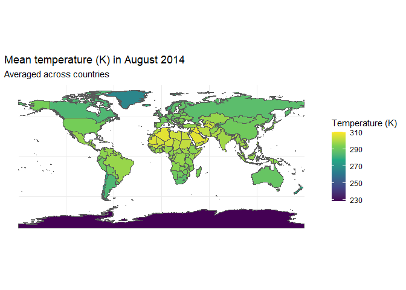

# gxc

# Example for ERA5 and polygons

## Package setup

``` r
# Install and load required packages
required_packages <- c("devtools", "keyring", "rnaturalearth", "sf", "tidyverse")
new_packages <- required_packages[!(required_packages %in% installed.packages()[,"Package"])]
if(length(new_packages)) install.packages(new_packages)
lapply(required_packages, library, character.only = TRUE)
```

    ## Lade nötiges Paket: usethis

    ## Linking to GEOS 3.12.1, GDAL 3.8.4, PROJ 9.3.1; sf_use_s2() is TRUE

    ## ── Attaching core tidyverse packages ──────────────────────── tidyverse 2.0.0 ──
    ## ✔ dplyr     1.1.4     ✔ readr     2.1.5
    ## ✔ forcats   1.0.0     ✔ stringr   1.5.1
    ## ✔ ggplot2   3.5.1     ✔ tibble    3.2.1
    ## ✔ lubridate 1.9.3     ✔ tidyr     1.3.1
    ## ✔ purrr     1.0.2     
    ## ── Conflicts ────────────────────────────────────────── tidyverse_conflicts() ──
    ## ✖ dplyr::filter() masks stats::filter()
    ## ✖ dplyr::lag()    masks stats::lag()
    ## ℹ Use the conflicted package (<http://conflicted.r-lib.org/>) to force all conflicts to become errors

    ## [[1]]
    ## [1] "devtools"  "usethis"   "stats"     "graphics"  "grDevices" "utils"    
    ## [7] "datasets"  "methods"   "base"     
    ## 
    ## [[2]]
    ##  [1] "keyring"   "devtools"  "usethis"   "stats"     "graphics"  "grDevices"
    ##  [7] "utils"     "datasets"  "methods"   "base"     
    ## 
    ## [[3]]
    ##  [1] "rnaturalearth" "keyring"       "devtools"      "usethis"      
    ##  [5] "stats"         "graphics"      "grDevices"     "utils"        
    ##  [9] "datasets"      "methods"       "base"         
    ## 
    ## [[4]]
    ##  [1] "sf"            "rnaturalearth" "keyring"       "devtools"     
    ##  [5] "usethis"       "stats"         "graphics"      "grDevices"    
    ##  [9] "utils"         "datasets"      "methods"       "base"         
    ## 
    ## [[5]]
    ##  [1] "lubridate"     "forcats"       "stringr"       "dplyr"        
    ##  [5] "purrr"         "readr"         "tidyr"         "tibble"       
    ##  [9] "ggplot2"       "tidyverse"     "sf"            "rnaturalearth"
    ## [13] "keyring"       "devtools"      "usethis"       "stats"        
    ## [17] "graphics"      "grDevices"     "utils"         "datasets"     
    ## [21] "methods"       "base"

``` r
# Load gxc package (locally for now)
devtools::load_all()
```

    ## ℹ Loading gxc

## Load a world map

``` r
# Download world map data
world <- ne_countries(scale = "medium", returnclass = "sf")
st_geometry(world)
```

    ## Geometry set for 242 features 
    ## Geometry type: MULTIPOLYGON
    ## Dimension:     XY
    ## Bounding box:  xmin: -180 ymin: -89.99893 xmax: 180 ymax: 83.59961
    ## Geodetic CRS:  WGS 84
    ## First 5 geometries:

    ## MULTIPOLYGON (((31.28789 -22.40205, 31.19727 -2...

    ## MULTIPOLYGON (((30.39609 -15.64307, 30.25068 -1...

    ## MULTIPOLYGON (((53.08564 16.64839, 52.58145 16....

    ## MULTIPOLYGON (((104.064 10.39082, 104.083 10.34...

    ## MULTIPOLYGON (((-60.82119 9.138379, -60.94141 9...

``` r
# Subset to relevant variables
world <- world |> 
  select(admin, iso_a3, postal, geometry)

# Create fixed date-variable
world$date_raw <- "08-2014"

# Plot world map
plot(world[1])
```

<!-- -->

## Store your API-key

``` r
api_key <- Sys.getenv("WF_API_KEY")

keyring::key_set_with_value(service = "wf_api_key", password = api_key)
```

## Run poly_link-function

``` r
dataset_out <- poly_link(
  indicator = "2m_temperature",
  data = world,
  date_var = "date_raw",
  time_span = 0,
  time_lag = 0,
  baseline = FALSE,
  min_year = "1989",
  max_year = "1990",
  order = "my",
  path = "./data/raw")
```

    ## User ecmwfr for ecmwfr service added successfully in keychain

## Explore the extended dataset

``` r
head(dataset_out)
```

    ## Simple feature collection with 6 features and 8 fields
    ## Geometry type: MULTIPOLYGON
    ## Dimension:     XY
    ## Bounding box:  xmin: -73.36621 ymin: -22.40205 xmax: 109.4449 ymax: 41.9062
    ## Geodetic CRS:  WGS 84
    ##       admin iso_a3 postal                       geometry date_raw  link_date
    ## 1  Zimbabwe    ZWE     ZW MULTIPOLYGON (((31.28789 -2...  08-2014 2014-08-01
    ## 2    Zambia    ZMB     ZM MULTIPOLYGON (((30.39609 -1...  08-2014 2014-08-01
    ## 3     Yemen    YEM     YE MULTIPOLYGON (((53.08564 16...  08-2014 2014-08-01
    ## 4   Vietnam    VNM     VN MULTIPOLYGON (((104.064 10....  08-2014 2014-08-01
    ## 5 Venezuela    VEN     VE MULTIPOLYGON (((-60.82119 9...  08-2014 2014-08-01
    ## 6   Vatican    VAT      V MULTIPOLYGON (((12.43916 41...  08-2014 2014-08-01
    ##   link_date_end time_span_seq focal_value
    ## 1    2014-08-01    2014-08-01    292.1692
    ## 2    2014-08-01    2014-08-01    294.7293
    ## 3    2014-08-01    2014-08-01    303.9748
    ## 4    2014-08-01    2014-08-01    299.5058
    ## 5    2014-08-01    2014-08-01    298.4276
    ## 6    2014-08-01    2014-08-01    297.7539

``` r
ggplot(data = dataset_out) +
  geom_sf(aes(fill = focal_value)) +
  scale_fill_viridis_c() +
  theme_minimal() +
  labs(
    title = "Mean temperature (K) in August 2014",
    subtitle = "Averaged across countries",
    fill = "Temperature (K)"
  )
```

<!-- -->
