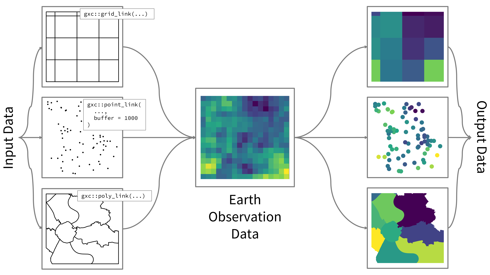

# gxc: Easy access to Earth observation data 🌎

## Description


Welcome to the package website of “GESIS meets Copernicus” (gxc).

For many researchers in the social sciences, Earth observation (EO) data
represents a black box. Social science researchers face many obstacles
in applying and using these data, resulting from 1) a lack of technical
expertise, 2) a lack of knowledge of data sources and how to access
them, 3) unfamiliarity with complex data formats, such as
high-resolution, longitudinal raster datacubes, and 4) lack of expertise
in integrating the data into existing social science datasets. `gxc`
aims to close the gap by creating an automated interface to EO data and
complementary resources for social science research.

The project’s core is creating an open-source tool to link time- and
space-sensitive social science datasets with data from Earth observation
programs. Detailed documentation and beginner-friendly tutorials
complement the tool to showcase the capability of our project. The
social science community is the main target group of our tool. At the
same time, Earth system science researchers may similarly profit from
integrated social science data. This project supports inter- and
transdisciplinary research which is often made difficult because of
technical, disciplinary, and organizational barriers. The project
emphasizes research data management (RDM) workflows based on FAIR data
and Open Science principles.

The unique feature of the tool is the possibility of carrying out both
geographically and temporally high-resolution queries of data from
Copernicus and other Earth observation data sources, which at the same
time function efficiently on simple workstations albeit large amounts of
data. Our workflow development has identified five major levers:
indicator type, indicator intensity, focal time period, baseline time
period, and spatial buffer. Flexibility on these five attributes should
be maximized for users. Thus, the tool offers the functionality to
automatically derive spatio-temporal links with other georeferenced data
(e.g., surveys, digital behavioral data).


Major attributes for indicator specification. Source: Abel and Jünger
2024

Users benefit from a curated core of EO variables which are most
relevant for social science research. For now, `gxc` is focused on
weather indicators. Additional indicators on local air quality,
greenhouse gas emissions (GHG), and land cover and use will be
integrated in the near term. The main data providers are the Copernicus
Monitoring Services on Climate Change, Atmosphere, and Land. For an
up-to-date list of all integrated data sources and variables, please
visit our [indicator
catalogue](https://denabel.github.io/gxc_pages/catalogue.html).

Europe’s Earth Observation programme is called
[Copernicus](https://www.copernicus.eu/en). It is funded and managed by
the European Commission and partners like the [European Space
Agency](https://www.esa.int/) (ESA) and the [European Organisation for
the Exploitation of Meteorological
Satellites](https://www.eumetsat.int/) (EUMETSAT). It has been
operational since 2014 and provides free access to a wealth of satellite
data from ESA’s “Sentinel” fleet. Copernicus combines data from
satellites, ground-based as well as air- and sea-borne sensors to track
the Earth system and provide this information largely free for all
customers.

The ESA describes Copernicus as the world’s most ambitious Earth
observation program, which will be further expanded in the coming years.
On the [Copernicus homepage](https://www.copernicus.eu/en/access-data.),
the daily data collection is estimated at 12 terabytes. Given the
complexity of issues, Copernicus has separated its services for public
usage along several thematic areas:

- **Atmosphere**: [Copernicus Atmosphere Monitoring
  Service](https://atmosphere.copernicus.eu/) (CAMS)
- **Marine**: [Copernicus Marine Service](https://marine.copernicus.eu/)
  (CMEMS)
- **Land**: [Copernicus Land Monitoring
  Service](https://land.copernicus.eu/en) (CLMS)
- **Climate change**: [Copernicus Climate Change
  Service](https://climate.copernicus.eu/) (C3S)
- **Emergency**: [Copernicus Emergency Management
  Service](https://emergency.copernicus.eu/) (CEMS).


Source: [Copernicus infrastructure and data
services](https://www.copernicus.eu/en/accessing-data-where-and-how/conventional-data-access-hubs)

## Keywords

geospatial data, spatial linking, Earth observation

## Social Science Use Case(s)

There are several major topics in the social sciences which could
benefit from the integration of EO:

1.  **Environmental social sciences** 🌱,
2.  **Conflict and peace research** 🕊,
3.  **Political attitudes and behavior** 🗳,
4.  **Policy studies** 📜,
5.  **Economic development and inequality** 📈, and
6.  **Public health** 💪.

The **environmental social sciences** are a growing research field at
the intersection between the Earth system and societies. One particular
topic, the role of extreme weather events for people’s environmental
attitudes and behavior, has especially benefited from a growing data
availability of EO data. A noteworthy study by [Hoffmann et
al. (2022)](https://doi.org/10.1038/s41558-021-01263-8) analyses how the
experience of climate anomalies and extremes influences environmental
attitudes and vote intention in Europe by integrating climatological,
survey, and parliamentary data.

Economists and social scientists who study **economic development and
inequality** exploit EO data in various forms to operationalize
independent variables such as drivers and barriers to development
(e.g. droughts) as well as dependent variables (e.g. night lights as
proxies for economic activity or the quality of rooftops as development
indicator). [García-León et
al. (2021)](https://doi.org/10.1038/s41467-021-26050-z), for example,
investigate historical and future economic impacts of recent heatwaves
in Europe and [Jean et
al. (2016)](https://doi.org/10.1126/science.aaf7894) show how nighttime
maps can be utilized as estimates of household consumption and assets.

## Repo Structure

This package provides six core functions to link your input data with EO
indicators. Depending on your data input format (points, polygons, or
raster) and the desired temporal resolution of the required indicators
(daily or monthly), you can choose from the list of functions below:

### For Spatial Points

**Key features:**  
- Extracts values directly from the underlying grid cell for each point,
or  
- Computes an aggregated mean over a specified buffer (in km) around
each point. - Supports baseline calculations and deviation computations.

**`point_link_daily`**  
*Designed for spatial point data (sf objects).*  
**Use when:** You have point observations (with an optional buffer) and
need daily indicator values.

**`point_link_monthly`**  
*Designed for spatial point data (sf objects).*  
**Use when:** You have point observations and need monthly indicator
values.

### For Polygons

**Key features:**  
- Extracts area-weighted averages from the raster for each polygon.  
- Supports baseline calculations and deviation computations.

**`poly_link_daily`**  
*Designed for polygon (or multipolygon) data (sf objects).*  
**Use when:** You have polygon features (e.g., administrative
boundaries) and need daily indicator values.

**`poly_link_monthly`**  
*Designed for polygon (or multipolygon) data (sf objects).*  
**Use when:** You have polygon features and need monthly indicator
values.

### For Gridded Data

**Key features:**  
- Aligns the downloaded daily data with your grid cells using resampling
and adds extracted values as new layer to the raster input.

**`grid_link_daily`**  
*Designed for gridded data (SpatRaster objects).*  
**Use when:** Your input data are gridded (e.g., regular rasters) and
you require daily indicator values.

**`grid_link_monthly`**  
*Designed for gridded data (SpatRaster objects).*  
**Use when:** Your input data are gridded and you need monthly indicator
values.

## Environment Setup

### API Access

The new system of data stores of the Copernicus services have simplified
access. With an [ECMWF](https://www.ecmwf.int/)-account, most indicators
from the Copernicus services are retrievable. In particular, this
account grants access to the
[Climate](https://cds.climate.copernicus.eu/),
[Atmosphere](https://ads.atmosphere.copernicus.eu/), [Early
Warning](https://ewds.climate.copernicus.eu/) data Stores.

To use most `gxc` functions, you need an ECMWF-account.

In order to access the Copernicus data services, we integrate the
[ecmwfr](https://github.com/bluegreen-labs/ecmwfr)-package into `gxc`.

### Parallel processing

`gxc` follows the parallel computing paradigm of the `future` package.
By default, this is disabled and the data will be processed through a
“standard” sequential pipeline. However, users can enable parallel
processing in all major functions (`parallel = TRUE`). This can
significantly increase execution time of processes which use large
datasets. In our functions, parallel computing becomes especially
relevant when observations are linked with EO data based on varying
focal time periods. At the same time, setting up a parallel plan and
chunk-based processing generates an overhead which could lead to
performance decreases compared to sequential approaches. This is
especially true for smaller datasets with narrower spatial extent and
fewer observations.

If `parallel=TRUE`, data processing is performed by pre-chunking input
data. The chunk sizes can be varied with `chunk_size=`. The default is
set to `50`.

### R Version

This package requires R version 4.2.0 or higher.

### Dependencies

All necessary package dependencies are listed in the DESCRIPTION file.
Key dependencies include:

- **sf** (for handling spatial vector data),
- **terra** (for raster data processing),
- **dplyr** (for data manipulation),
- **lubridate** (for date/time processing),
- **keyring** (for secure key management),
- **ecmwfr** (for interacting with the CDS API),
- **future.apply** (for parallel processing),
- **progressr** (for progress reporting).

## Hardware Requirements

`gxc` is meant to function efficiently on simple workstations. However,
if users have access to a cluster environment, you can set up a
cluster-plan with the `future`-package.

## Input Data

The input data format depends on the selected function.
-**`point_link_`**-functions: spatial point objects (`sf`)
-**`poly_link_`**-functions: spatial polygon or multipolygon objects
(`sf`) -**`grid_link_`**-functions: gridded raster files (`SpatRaster`)

## Sample Input and Output Data

In general, output files will have the same format as the input files.
Indicator values are added as additional variables to `sf` objects and
as additional layers to `SpatRaster` objects. When spatial buffer are
specified for point data, the `sf`-output file contains polygons.

The figure below visualizes how the selected EO indicator will be
processed based on the different input formats.



## How to Use

### Example 1: Retrieving daily temperature for point data

In this first example, we show how to utilize the
`point_link_daily`-function from the `gxc`-package to integrate
temperature data from ERA5 reanalysis for a set of spatial points.

### Package setup

We need some packages to load and prepare the world map
(`rnaturalearth`, `sf`, and `tidyverse`). We also need the
`keyring`-package to safely store our API key. Finally, we need
`devtools` to load the `gxc`-package.

``` r
# Install and load required packages
required_packages <- c("devtools", "keyring", "rnaturalearth", "sf", "tidyverse")
new_packages <- required_packages[!(required_packages %in% installed.packages()[,"Package"])]
if(length(new_packages)) install.packages(new_packages)
lapply(required_packages, library, character.only = TRUE)

# Load gxc package
devtools::load_all()
```

### Create sample point data

Let’s assume we have a sample of survey respondents across Germany with
a field period from July to August 2019. We would like to extend this
dataset with temperature data from the specific interview day. We create
a sample of random points based on a shapefile for Germany and add
random day variables for the field period.

``` r
# Get Germany's boundary as an sf object
germany <- ne_countries(scale = "medium", country = "Germany", returnclass = "sf")

# Generate 1000 random points within Germany's boundary
random_points <- st_sample(germany, size = 1000)

# Convert to an sf object with proper geometry column
points_sf <- st_sf(geometry = random_points)

# Random date within day, month and year limits of field period
set.seed(123)
months <- c("7", "8")
years <- c("2019")
days <- 1:31
n <- nrow(points_sf)
points_sf$date_raw <- paste0(sample(years, n, replace = TRUE), "-",
                         sample(months, n, replace = TRUE), "-",
                         sample(days, n, replace = TRUE)
                         )
```

### Store your API-key

A final setting before we can access the `point_link_daily`-function is
to store our API key. By setting it to “wf_api_key”, the function
automatically retrieves the key.

``` r
api_key <- Sys.getenv("WF_API_KEY")

keyring::key_set_with_value(service = "wf_api_key", password = api_key)
```

### Run function

Check out vignette for `point_link_daily` for detailed documentation.

``` r
# ?point_link_daily
```

Here, we would like to retrieve the daily maximum temperature
(`statistic = "daily_maximum`) for the specific interview day
(`time_span = 0` and `time_lag = 0`) in a 10km area around the
respondents location (`buffer = 10`).

``` r
dataset_out <- point_link_daily(
  indicator = "2m_temperature",
  data = points_sf,
  date_var = "date_raw",
  time_span = 0,
  time_lag = 0,
  buffer = 10,
  baseline = FALSE,
  order = "ymd",
  path = "./data/raw",
  catalogue = "derived-era5-land-daily-statistics",
  statistic = "daily_maximum",
  time_zone = "utc+00:00",
  keep_raw = FALSE,
  parallel = FALSE,
  chunk_size = 50
)
```

### Explore the extended dataset

We can see that the function has added additional columns on the linking
dates, and the actual values (in Kelvin), averaged across the buffer
zone.

``` r
head(dataset_out)
```

    ## Simple feature collection with 6 features and 5 fields
    ## Geometry type: POLYGON
    ## Dimension:     XY
    ## Bounding box:  xmin: 8.633732 ymin: 47.73227 xmax: 13.03843 ymax: 52.71189
    ## Geodetic CRS:  WGS 84
    ##                         geometry  date_raw  link_date link_date_end
    ## 1 POLYGON ((13.03843 48.30216...  2019-7-1 2019-07-01    2019-07-01
    ## 2 POLYGON ((12.46849 47.79265... 2019-8-31 2019-08-31    2019-08-31
    ## 3 POLYGON ((12.63989 48.11225... 2019-8-17 2019-08-17    2019-08-17
    ## 4 POLYGON ((8.813395 50.90298... 2019-7-18 2019-07-18    2019-07-18
    ## 5 POLYGON ((8.915953 52.65743... 2019-8-10 2019-08-10    2019-08-10
    ## 6 POLYGON ((9.610477 51.52758...  2019-7-9 2019-07-09    2019-07-09
    ##   time_span_seq focal_value
    ## 1    2019-07-01    303.7075
    ## 2    2019-08-31    299.5410
    ## 3    2019-08-17    297.4355
    ## 4    2019-07-18    298.0684
    ## 5    2019-08-10    296.9746
    ## 6    2019-07-09    288.8733

``` r
ggplot(data = dataset_out) +
  geom_sf(aes(fill = focal_value)) +
  scale_fill_viridis_c() +
  theme_minimal() +
  labs(
    title = "Mean temperature (K) in July/August 2019",
    subtitle = "At respondent location on interview day",
    fill = "Temperature (K)"
  )
```

<!-- -->

### Example 2: Retrieving monthly averaged precipitation for countries

In this example, we show how to utilize the `poly_link_monthly`-function
from the `gxc`-package to integrate precipitation data from the ERA5
reanalysis across countries and for a specific point in time. We will
enable parallel processing.

### Package setup

We need some packages to load and prepare the world map
(`rnaturalearth`, `sf`, `future`, and `tidyverse`). We also need the
`keyring`-package to safely store our API key. Finally, we need
`devtools` to load the `gxc`-package.

``` r
# Install and load required packages
required_packages <- c("devtools", "keyring", "rnaturalearth", "sf", "tidyverse", "future")
new_packages <- required_packages[!(required_packages %in% installed.packages()[,"Package"])]
if(length(new_packages)) install.packages(new_packages)
lapply(required_packages, library, character.only = TRUE)

# Load gxc package
devtools::load_all()
```

### Load a world map

Let’s assume we require global precipitation data for October 2014. We
load the shapefile containing country-level polygons, subset it to the
most relevant variables, and add a time variable.

``` r
# Download world map data
world <- ne_countries(scale = "medium", returnclass = "sf")
st_geometry(world)
```

    ## Geometry set for 242 features 
    ## Geometry type: MULTIPOLYGON
    ## Dimension:     XY
    ## Bounding box:  xmin: -180 ymin: -89.99893 xmax: 180 ymax: 83.59961
    ## Geodetic CRS:  WGS 84
    ## First 5 geometries:

    ## MULTIPOLYGON (((31.28789 -22.40205, 31.19727 -2...

    ## MULTIPOLYGON (((30.39609 -15.64307, 30.25068 -1...

    ## MULTIPOLYGON (((53.08564 16.64839, 52.58145 16....

    ## MULTIPOLYGON (((104.064 10.39082, 104.083 10.34...

    ## MULTIPOLYGON (((-60.82119 9.138379, -60.94141 9...

``` r
# Subset to relevant variables
world <- world |> 
  select(admin, iso_a3, postal, geometry)

# Create fixed date-variable
world$date_raw <- "08-2014"

# Plot world map
plot(world[1])
```

<!-- -->

### Store your API-key

A final setting before we can access the `poly_link_monthly`-function is
to store our API key. By setting it to “wf_api_key”, the function
automatically retrieves the key.

``` r
api_key <- Sys.getenv("WF_API_KEY")

keyring::key_set_with_value(service = "wf_api_key", password = api_key)
```

### Parallel processing

We also set up a multisession with the `future`-package. We select six
workers (rule of thumb: maximum number of cores - 1).

``` r
future::plan(multisession, workers = 6)
```

### Run poly_link-function

Check out vignette for `poly_link_monthly` for detailed documentation.

``` r
# ?poly_link_monthly
```

We want to directly retrieve the averaged total precipitation data for
August 2014 (`time_span = 0` and `time_lag = 0`). We furthermore enable
parallel processing (`parallel = TRUE`) and rely on the default chunk
size (`chunk_size = 50`).

``` r
dataset_out <- poly_link_monthly(
  indicator = "total_precipitation",
  data = world,
  date_var = "date_raw",
  time_span = 0,
  time_lag = 0,
  baseline = FALSE,
  order = "my",
  path = "./data/raw",
  catalogue = "reanalysis-era5-land-monthly-means",
  by_hour = FALSE,
  keep_raw = FALSE,
  parallel = TRUE,
  chunk_size = 50
  )

# Set back to sequential plan
future::plan(sequential)
```

### Explore the extended dataset

We can see that the function has added additional columns on the linking
dates, and the actual values, averaged across countries.

``` r
head(dataset_out)
```

    ## Simple feature collection with 6 features and 8 fields
    ## Geometry type: MULTIPOLYGON
    ## Dimension:     XY
    ## Bounding box:  xmin: -73.36621 ymin: -22.40205 xmax: 109.4449 ymax: 41.9062
    ## Geodetic CRS:  WGS 84
    ##       admin iso_a3 postal                       geometry date_raw  link_date
    ## 1  Zimbabwe    ZWE     ZW MULTIPOLYGON (((31.28789 -2...  08-2014 2014-08-01
    ## 2    Zambia    ZMB     ZM MULTIPOLYGON (((30.39609 -1...  08-2014 2014-08-01
    ## 3     Yemen    YEM     YE MULTIPOLYGON (((53.08564 16...  08-2014 2014-08-01
    ## 4   Vietnam    VNM     VN MULTIPOLYGON (((104.064 10....  08-2014 2014-08-01
    ## 5 Venezuela    VEN     VE MULTIPOLYGON (((-60.82119 9...  08-2014 2014-08-01
    ## 6   Vatican    VAT      V MULTIPOLYGON (((12.43916 41...  08-2014 2014-08-01
    ##   link_date_end time_span_seq  focal_value
    ## 1    2014-08-01    2014-08-01 5.770897e-05
    ## 2    2014-08-01    2014-08-01 1.161533e-05
    ## 3    2014-08-01    2014-08-01 8.133225e-04
    ## 4    2014-08-01    2014-08-01 9.156265e-03
    ## 5    2014-08-01    2014-08-01 8.992145e-03
    ## 6    2014-08-01    2014-08-01 2.695586e-04

``` r
ggplot(data = dataset_out) +
  geom_sf(aes(fill = focal_value)) +
  scale_fill_viridis_c() +
  theme_minimal() +
  labs(
    title = "Average total precipitation in August 2014",
    subtitle = "Averaged across countries",
    fill = "Averaged total precipitation"
  )
```

<!-- -->

## Contact Details

For questions or contributions, please contact Dennis Abel
(<dennis.abel@gesis.org>) and Stefan Jünger
(<stefan.juenger@gesis.org>).

## Disclaimer

Access to data from [Copernicus Climate Change
Service](https://cds.climate.copernicus.eu/), [Copernicus Atmosphere
Monitoring Service](https://ads.atmosphere.copernicus.eu/), and
[Copernicus Emergency Management
Service](https://ewds.climate.copernicus.eu/) requires a user-account
with the [European Center for Medium-Range Weather Forecasts
(ECMWF)](https://www.ecmwf.int/). Please ensure you follow their Terms
and Conditions.
